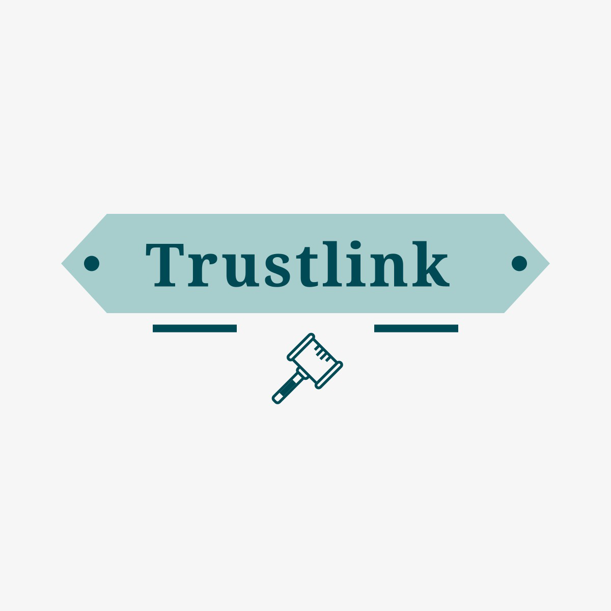
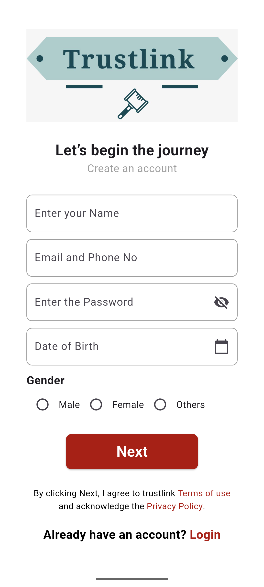
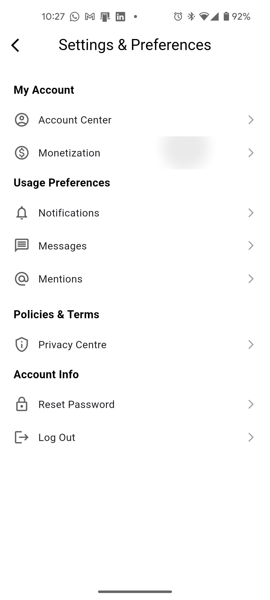
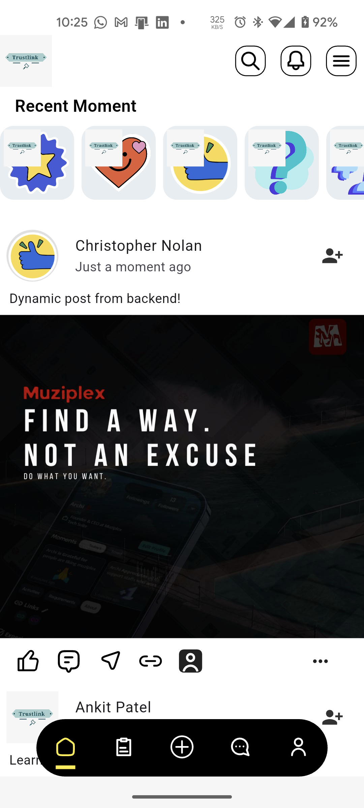

#  TrustLink



TrustLink is a Flutter-based mobile application designed to connect professionals and organizations by sharing achievements and facilitating donations. It provides a platform for users to showcase their milestones, support causes they care about, and build meaningful connections.

## Screenshots
TODO:
## Features

- **User Profiles**: Create and customize your profile to showcase your professional achievements.
- **Timeline**: Share and view moments of success and milestones from other users.
- **Donations**: Uses [Starknet](https://github.com/starknet-io/starknet.js) for transactions, supporting Starknet and Ethereum coins.
- **Chat**: Connect and communicate with other users directly through the app.
- **Requirement Management**: Post and manage requirements for professional or organizational needs.

## Screenshots
TODO: Add screenshots and a demo video.




## Getting Started

Follow these steps to set up and run the TrustLink app on your local machine:

### Prerequisites

- [Flutter SDK](https://docs.flutter.dev/get-started/install) installed.
- Android Studio or Visual Studio Code for development.
- A connected device or emulator for testing.

### Installation

#### Backend
All necessary files can be found in the [TrustLink Backend Repository](https://github.com/hawkaii/TrustLink_backend).

1. Clone the repository:
   ```bash
   git clone https://github.com/hawkaii/trustlink.git
   cd trustlink
   flutter run
   ```

## Resources
- [Flutter](https://flutter.dev)
- [starknet.js](https://github.com/starknet-io/starknet.js)


